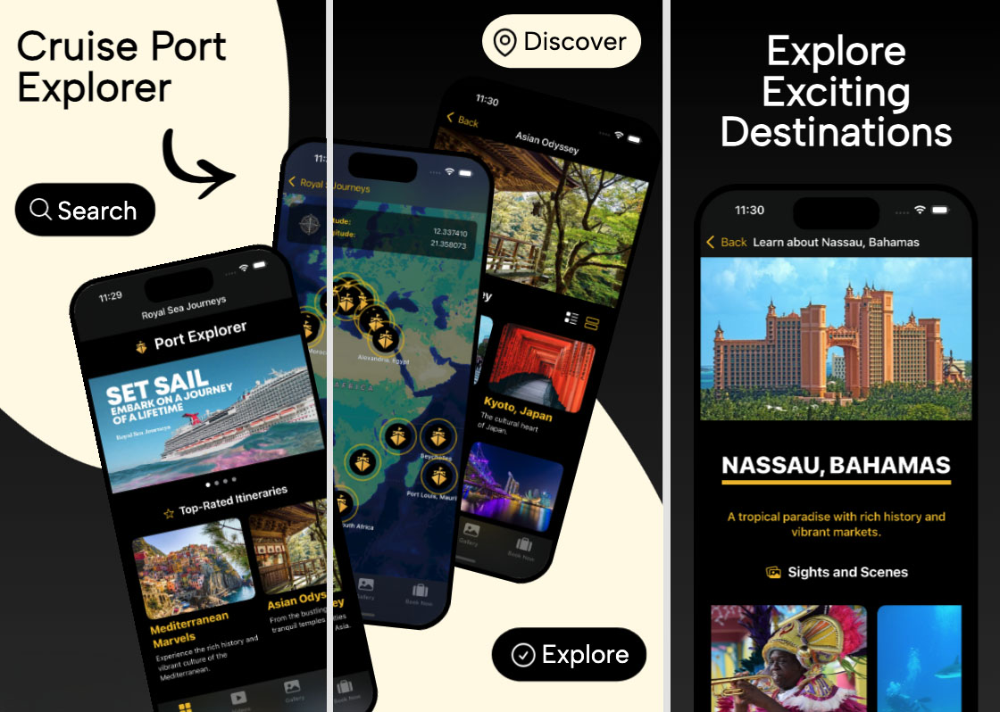
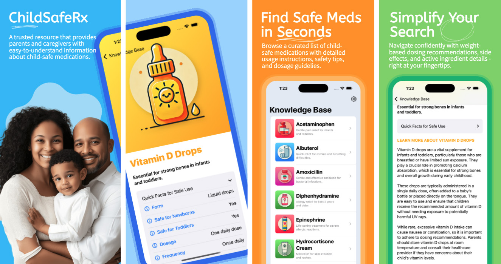
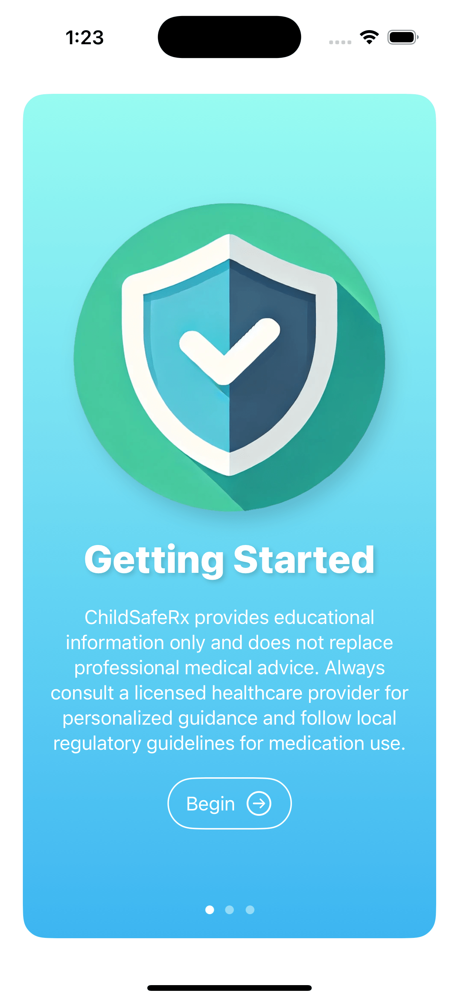
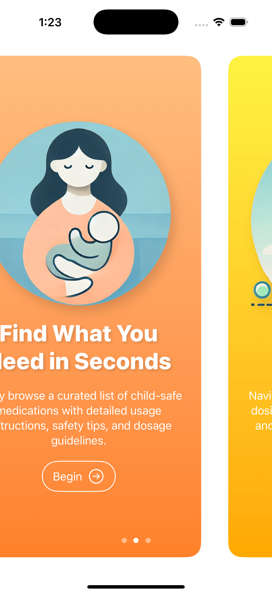
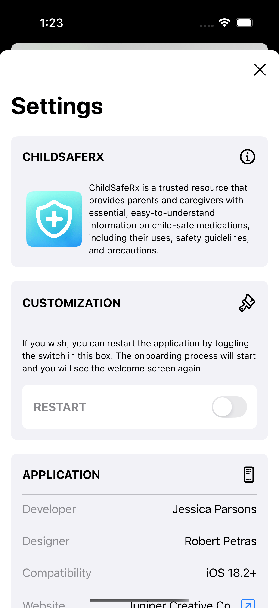
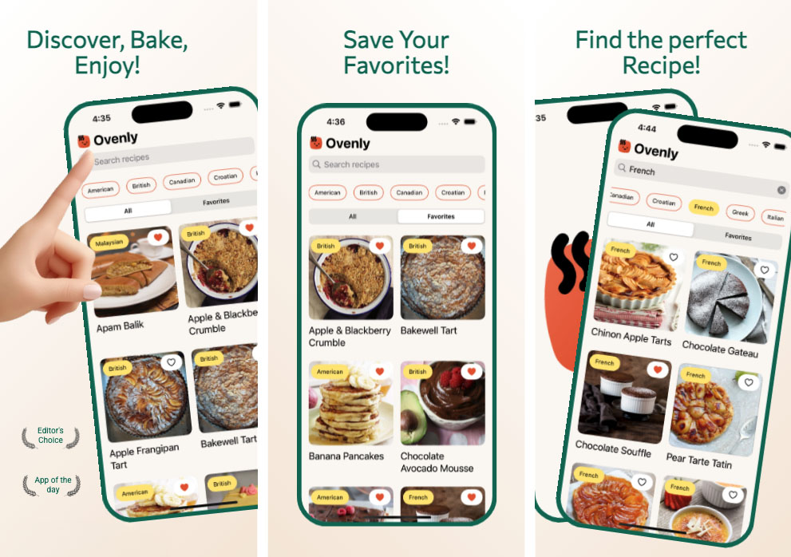
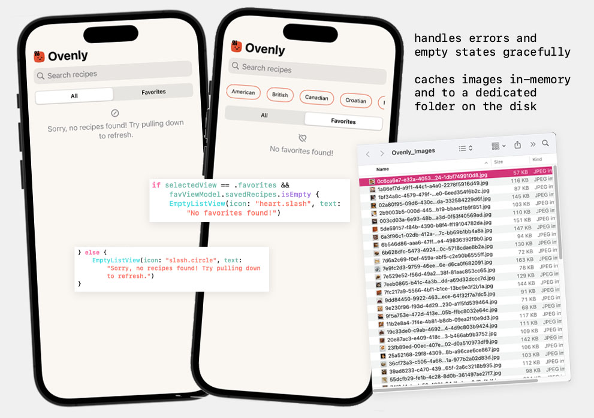

# iOS Engineer Portfolio
Showcasing my best Swift iOS apps that are crafted with clean code, great UI, and solid architecture.

# 1. ⛴️ *Royal Sea Journeys: Port Explorer**  

**Royal Sea Journeys: Port Explorer** is a fully-featured iOS application designed to bring the ultimate cruise itinerary to life. With a stunning user interface, Port Explorer harnesses the power of **MapKit** and external APIs to deliver dynamic travel content. Whether you're discovering unique shore excursions, exploring breathtaking ports of call, or planning your next adventure, this app is your ultimate digital companion for all things cruising.

## Screenshots



## Demo
| iPhone | iPad |
| ------------- | ------------- |
|  |  |

## **Key Features**

### 🗺 **Interactive Map Explorer**  
- Powered by **MapKit**, users can:
  - Navigate a world map to discover ports of call for various itineraries.  
  - Tap on interactive **map annotations** to explore detailed port information.
  - View real-time latitude and longitude coordinates via a sleek overlay.

### 📅 **API Provided Itinerary Highlights**  
- **Integrates with a travel API** to fetch itinerary and port data, and displays itineraries with carousel and grid layouts.
- Drill down into itinerary details with seamless navigation to ports of call.
- Utilizes the **Kingfisher** SKD for optimized image caching and loading.

### 📹 **Dynamic Video Galleries**  
- Integrates with the **Pixabay Video API** to showcase dynamically loaded travel videos

### 📷 **Customizable Photo Gallery**  
- A polished, user-friendly interface that supports dynamic filtering, lazy loading for performance, and toggleable grid views.
- Images are fetched from the external travel API and cached with Kingfisher, ensuring modularity and scalability.  
### 📱 **iPad Support**  
- The app fully supports **iPadOS**, offering a rich and immersive experience on larger screens.  

## **Other Highlights**  

- **Modern Swift Practices**  
  - Leveraged **async/await** for API calls and data fetching.
  - Used `@MainActor` annotations to ensure thread-safe UI updates.

- **UI and User Experience**  
 
  - Implemented **accessibility features** for improved usability, including VoiceOver support.  

- **Modular and Scalable Code**  

  - Used **MVVM** for scalable data flow management.


## 🚀 **Built With**  

- Swift 5
- SwiftUI
- Xcode 16.2 

### Installation  
1. Clone the repository:  
   ```bash
   git clone https://github.com/your-username/RoyalSeaJourneys.git


# 2. 🩺 ChildSafeRx
A trusted app for parents and caregivers, providing child-safe medication guidance and information.

## About
- Comprehensive list of child-safe medications.
- Detailed dosage, safety guidelines, and precautions.
- Simple, intuitive UI designed for caregivers.

## Screenshots

|   |   |   |
| ------------- | ------------- | ------------- |
|  |  |  |

## Demo
| iPhone | iPad |
| ------------- | ------------- |
|  |  |


## Key Features
- 📱 Modern iOS Development
  - Built using SwiftUI, leveraging declarative syntax for efficient and clean UI development.
  - Designed for iOS 18, ensuring compatibility with modern app design and functionality.
- 🖌️ Dynamic User Interface
  - Multi-screen onboarding flow implemented with PageTabView for a seamless user introduction.
  - Responsive and visually engaging child-friendly interface with dynamic, data-driven content.
- 📊 Advanced Data Management
  - Dynamically loads and organizes medication information using JSON parsing.
  - Custom data model processes JSON input efficiently.
  - Leveraged Swift's Codable protocol for clean and maintainable data decoding and handling.
- 🔒 State Management
  - AppStorage used for persistent data storage, enabling smooth state-saving functionality.
  - Dynamic views that adapt to user interaction and data changes.
- 📜 Dynamic Content Display
  - Designed dynamic List Views to render child-safe medications using reusable components.
  - Scalable and modular UI architecture for future feature expansion.
- 👨‍👩‍👧 User-Centric Design
  - Prioritized accessibility with child-friendly visuals and simple navigation.
  - Clear warnings and disclaimers to promote safe and responsible usage.
- 📂 Version Control and Documentation
  - Managed the project using Git for version control and GitHub for portfolio presentation.

## Built With
- Swift 5
- SwiftUI
- Xcode 16.2


# 3. 🍰 Ovenly – A Delightful Way to Discover & Save Baking Recipes  

## ✨ Summary  
Ovenly is a single-view portfolio SwiftUI app that helps users discover and save baking recipes sorted by regional cuisine. With a focus on smooth user experience and Swift Concurrency, Ovenly allows users to:  

- ✅ **Browse Baking Recipes** by regional cuisine with an intuitive UI.  
- ✅ **Search Recipes** using a search bar or by selecting cuisine-type chips.  
- ✅ **Save Favorites** to a personalized list for quick access.  
- ✅ **Pull to Refresh** for the latest recipes.  
- ✅ **Fast Image Loading** with a custom-built caching system for optimal performance.  

Ovenly is designed for **iOS 16+** and built entirely with **SwiftUI**. In addition, Ovenly is designed with **MVVM** architecutre for scalable data flow management and testing, and includes **accessibility features** for improved usability. 

## Screenshots



## Demo


## 🎯 Focus Areas  
I prioritized two key areas in this project:  

### 💡 User Interface & Experience  
- I focused on **polished UI interactions, delightful animations, and haptic feedback** to make the app engaging.  
- Baking is a joyful activity, and I wanted the app to reflect that joy in its design.  

### 🖼️ Efficient Image Caching
- Image loading was a UX bottleneck, so I implemented **both in-memory caching and disk caching** in addition to lazy loading and asyncImage to reduce unnecessary network requests.  
- This ensures a smooth browsing experience, even when scrolling through many recipes. 

## ⏳ Time Spent  
I dedicated **several days** to this project:

- 🛠 **Testing & Debugging** – A significant portion of my time was spent on writing and refining unit tests.  
- 📌 **Building the Favorites Feature** – Building the favorites feature was an exercise in saving to User Defaults, as well as a new level of unit testing.
- 🎨 **UI Enhancements** – I just love UI design, so I spent more time on a delightful design. 

Since I wanted to fully explore Swift Concurrency and SwiftUI, I took my time to build everything properly without rushing.  

### Future Enhancements:
- In production, I would meet with the app architect to decide if the favorites should also be saved to the same place as the images are cached, instead of to User Defaults.
- For future apps, I would still choose to use a third-party library for image caching in production to save development time.  

## Final Thoughts  
Ovenly was a fun and rewarding project! It allowed me to showcase my UI skills, explore Swift Concurrency, and practice manual image caching. I'm proud of the smooth user experience and thoughtful details built into the app.  


## 🚀 Built With  

- Swift 5
- SwiftUI
- Xcode 16.2 

### Installation  
1. Clone the repository:  
   ```bash
   git clone https://github.com/your-username/Ovenly.git

